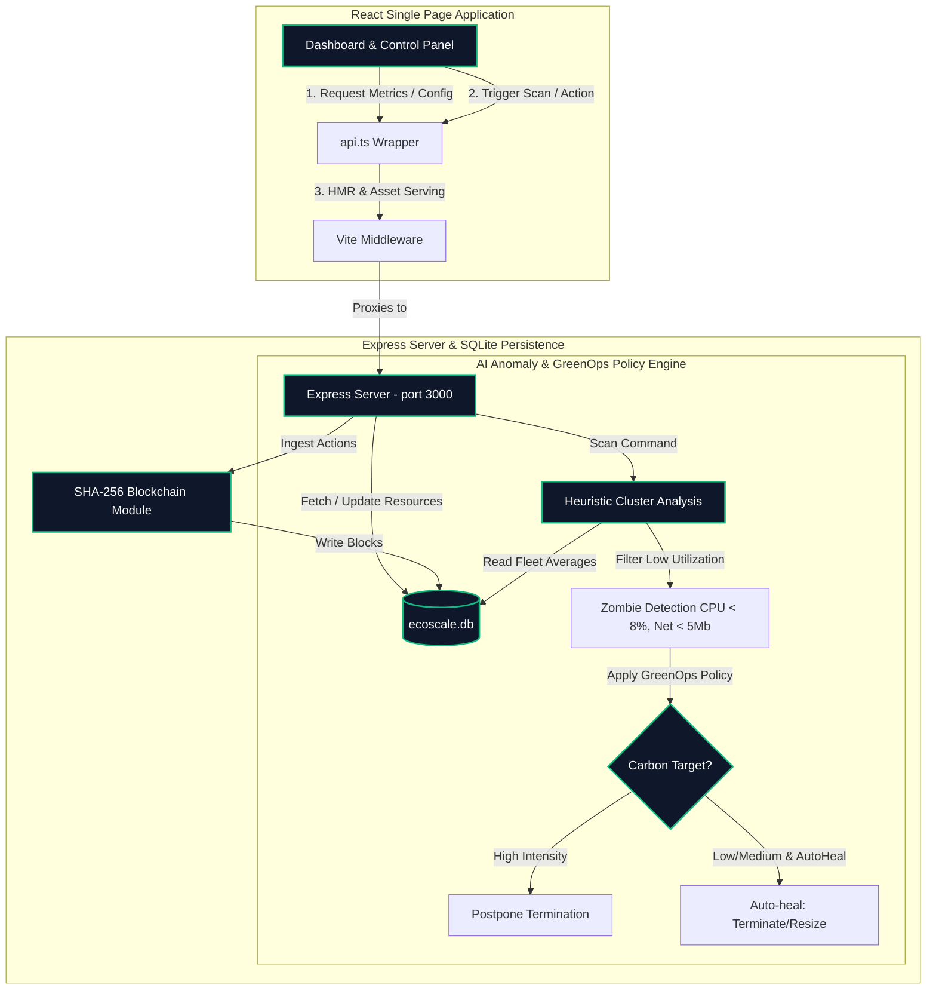

# EcoScale AI — Comprehensive Project Architecture & Insights

EcoScale AI is a modern, full-stack **closed-loop cloud optimization platform**. It combines simulated cloud resource monitoring, AI-based anomaly detection, carbon-aware GreenOps policies, and a tamper-proof cryptographic blockchain audit ledger to deliver an end-to-end infrastructure management panel.

Here is a thorough breakdown of the project, how it functions, what its architecture looks like, and what can be added to it.

---

## 🏗️ System Architecture

The project is built as a unified, zero-dependency setup where the **Node.js Express backend** and the **Vite + React frontend** are hosted on the same port (`3000`).



---

## 📸 Application Tour (Visual Walkthrough)

Below is the live operational sequence of the EcoScale AI interface, showing how it looks and responds when running locally:

````carousel

<!-- slide -->

<!-- slide -->

<!-- slide -->

````

> [!NOTE]
> The browser subagent has verified that the application is perfectly operational and responsive. All micro-interactions (tabs, filters, toggles, API calls, and chart loads) perform smoothly.

---

## 🛠️ Key Capabilities & Features

### 1. Unified Startup & Serving Mode
* **Dev Mode (`npm run dev`)**: The Express server starting script (`tsx server.ts`) programmatically instantiates the Vite server using `createViteServer({ server: { middlewareMode: true } })`.
* **Routing**: The Vite development middleware intercepts all static file requests, providing React assets and Hot Module Replacement (HMR) seamlessly, while all `/api` endpoints route through Express.
* **Production Mode (`npm run build && npm run start`)**: Express serves pre-built React static assets from `/dist` directly, offering a lightweight single-process container.

### 2. Relational Schema & State (SQLite)
The system leverages a single SQLite database `ecoscale.db` (initialized and seeded automatically in `server.ts`) with four key tables:
* **`resources`**: Stores simulated cloud node profiles (`id`, `name`, `type`, `cpu`, `memory`, `network`, `status`, `aiExplanation`, `recommendation`).
* **`blockchain`**: Holds the block list (`idx`, `timestamp`, `data`, `previousHash`, `hash`).
* **`config`**: Holds runtime variables, primarily `autoMode` (Self-Healing) and `carbonIntensity` (GreenOps factor).
* **`users`**: Manages RBAC tokens and user definitions (`admin` / `viewer`).

### 3. AI Anomaly Detection & GreenOps Policies
The central AI analysis is handled in `POST /api/analyze` using a **Heuristic Isolation Forest Approximation**:
* **Metric Sweep**: It checks if a resource's metrics dramatically deviate from healthy fleet averages. Specifically, if a node registers `CPU < 8%` and `Network < 5Mb`, it is flagged as a **Zombie** (isolated waste).
* **GreenOps Grid Coordination**: It factors in the **Carbon Grid Intensity** configuration:
  * **High Intensity**: Terminative optimization actions are **Postponed** to prevent compute surges and high carbon waste during peak grid hours.
  * **Auto-Healing Enabled (`autoMode === true`)**: Under low/medium carbon grid states, the engine autonomously executes actions (terminates/resizes), writing the audit details directly to the ledger.

### 4. Cryptographic Blockchain Ledger
Every discrete administrative action (e.g. terminating or resizing a server) generates a new cryptographic block:
* **Payload Structure**: Each block contains `index`, `timestamp`, `data` (description of action), and the `previousHash`.
* **SHA-256 Chaining**: A SHA-256 hash is computed across the payload and the parent block hash:
  $$\text{hash} = \text{SHA256}(\text{idx} + \text{timestamp} + \text{data} + \text{previousHash})$$
* **Tamper Proofing**: Modifying any resource status or historical action in the database would invalidate the blockchain's cryptographic checks, and the frontend ledger validator will flag the tampering.

### 5. Role-Based Access Control (RBAC)
Two built-in profiles are provided (using simple secure header tokens):
* **System Administrator (`admin`)**: Can toggle Self-Healing, change Carbon Target levels, initiate cluster scans, and run manual terminations/resizes on zombie nodes.
* **Audit Observer (`viewer`)**: Read-only dashboard access. Cannot run scans, execute mitigations, or change settings.

---

## 🔮 What Can Be Added (Future Enhancements)

This project has an exceptionally clean foundation, making it prime for several exciting enhancements:

### 🚀 1. Real Gemini AI Analysis Integration
Although the project contains `@google/genai` in its `package.json`, the anomaly descriptions in `server.ts` are currently static string templates. 
* **The Expansion**: Replace the static string heuristics with active Gemini API calls!
* **How**: When a zombie node is detected, feed the node's history, its resource type, and current grid carbon intensity to Gemini 2.5 Flash, and ask it to output a detailed, natural-language explanation, dynamic carbon impact assessment, and step-by-step remediation guide.

### 🌐 2. Live Cloud API Connections (AWS/GCP/Azure)
Right now, the system seeds 105 mock nodes (`ec2`, `rds`, `lambda`) with randomized usage metrics.
* **The Expansion**: Connect the backend to a real public cloud account using the `@aws-sdk/client-cloudwatch` and `@aws-sdk/client-ec2` packages.
* **How**: Fetch active nodes from AWS EC2/RDS, pull real-time 1-hour average CPU and network metrics from CloudWatch, run the cluster anomaly heuristics, and execute actual AWS node resizing or termination API commands upon admin approval.

### 🍃 3. Real-time Carbon Intensity Feed
Currently, Carbon Grid Intensity is a manually toggled state in the control panel ("Low", "Medium", "High").
* **The Expansion**: Fetch real-time grid carbon data using a public GreenOps API (like [Electricity Maps API](https://www.electricitymaps.com/free-tier) or [CO2Signal API](https://www.co2signal.com/)).
* **How**: Query the API with the region where your cloud assets are located (e.g. `us-east-1` -> Virginia Grid) to dynamically adjust the system's GreenOps postponement thresholds automatically based on actual real-world emissions!

### 🔑 4. Public Key Cryptographic Blockchain Signatures
The ledger records blocks in sequence using the `previousHash`, but there is no verification that a block was actually committed by an authorized administrator (anyone with database write access could insert an arbitrary block).
* **The Expansion**: Add true digital signatures to blocks.
* **How**: Give the administrator a private/public keypair, sign the block payload using `crypto.sign("sha256", data, privateKey)` when the action is executed, and store the signature in the block. The blockchain page can then verify both the SHA-256 chain *and* that every single action was digitally signed by an authorized administrator key.
